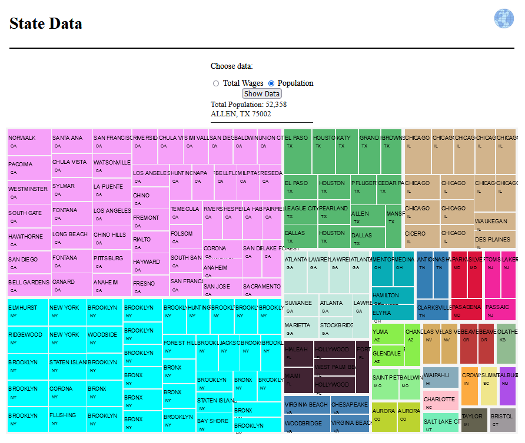

# Data Visualization Projects
### Projects were developed using HTML, Bootstrap, Javascript, Google Charts, jQuery, PHP, SQL.
### There are sources that I used during my learning process of data visualization below.

## Project 1 Baseball Stats
The dataset is on homeruns in the year 2017. There are 13 attributes with 6093 records. Batters from teams of the National League East Division: Atlanta Braves, New York Mets, Philadelphia Phillies, Miami, Marlins, and Washington Nationals and the New York Yankees from the American League East Division.

The provided homeruns2017.csv dataset can be loaded under the File tab using Load CSV function.
Data visualizations will be shown based on the choices provided:
    Table Area: Data provided in a table
    Data Info: Average Distance,  Estimated Exit Velocity and Parks With Most Home Runs
    Graph: Bar, Line, Pie
***
## Project 2 NJ Wages and Population Stats
Additional functionalities are added to Project 1. 
Reading data from MySQL database, which requires user log in to the database to process and visualize data based on options provided.
Additional data visualizations graphs are given such as a scatterbox plot.
In both project, under the Help tab Project Information is provided for a glimpse of the expected outputs and directions.
***
## Study 1 Quarterback Stats 2020
Data is based on NFL data from the year 2020. It is read from the database to plot data on specific throws based on the quarterback that is chosen.
Throw information: completion, touchdown, incomplete
Quarterbacks: Tom Brady, Patrick Mahomes, Josh Allen, etc.
***
## Study 2 State Wages and Population Stats
Treemap of Total Wages or Population of all states.

***
Sources: https://www.youtube.com/watch?v=wvfBn7GCCHk, https://observablehq.com/@d3/zoomable-treemap